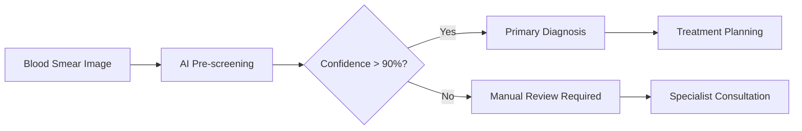

# 🩸 Deteksi Leukemia Limfoblastik Akut (ALL) dengan Deep Learning

Proyek ini mengembangkan dan membandingkan **tiga model pembelajaran mesin** untuk klasifikasi otomatis **Acute Lymphoblastic Leukemia (ALL)** meng## 🎯 Model Comparison

### Performance vs Efficiency Analysis

```python
# Comparison Matrix
┌──────────────────┬───────────┬─────────────┬────────────┬─────────────────┐
│     Model        │ Accuracy  │ Parameters  │ Speed      │ Deployment      │
├──────────────────┼───────────┼─────────────┼────────────┼─────────────────┤
│ VGG16 Fine-Tune  │  98.62%   │   14.8M     │    Slow    │ Research Lab    │
│ VGG16 Baseline   │  98.31%   │   14.8M     │   Medium   │ ✅ Production   │
│ CNN Custom       │  95.0%    │   127K      │    Fast    │ Mobile/Edge     │
└──────────────────┴───────────┴─────────────┴────────────┴─────────────────┘
```

### Recommended Usage:

#### 🏥 **Clinical Production (Recommended: VGG16 Baseline)**

- ✅ 98.31% accuracy (clinical-grade)
- ✅ Stable and predictable performance
- ✅ Balance between accuracy and complexity
- ✅ Ready for hospital integration

#### 🔬 **Research & Development (VGG16 Fine-Tune)**

- ⭐ Peak performance (98.62%)
- ⭐ Perfect precision for cancer classes
- ⚠️ Requires careful hyperparameter tuning
- 🎯 Ideal for research validation

#### 📱 **Mobile/Edge Computing (CNN Custom)**

- ⚡ 116x fewer parameters (127K vs 14.8M)
- ⚡ Fast inference on mobile devices
- ⚡ Low memory footprint
- 🎯 95% accuracy masih excellent untuk screening

## 💻 Instalasi

### System Requirements

- **Python**: 3.8+ (Recommended: 3.10)
- **RAM**: 8GB minimum (16GB recommended)
- **GPU**: CUDA-capable GPU (optional tapi recommended)
- **Storage**: 2GB untuk dataset + models

### Quick Installation

```bash
# Clone repository
git clone https://github.com/maybeitsai/leukimia-detection.git
cd leukimia-detection

# Install dependencies
pip install -r requirements.txt

# Or manual installation
pip install tensorflow keras numpy pandas matplotlib seaborn
pip install scikit-learn opencv-python pillow gdown tqdm
```

### GPU Setup (Recommended)

```bash
# For CUDA support (significant speedup)
pip install tensorflow-gpu
# Verify GPU detection
python -c "import tensorflow as tf; print(tf.config.list_physical_devices('GPU'))"
```
pheral Blood Smear_ (PBS). Model-model yang dikembangkan meliputi: **CNN Custom**, **VGG16 Baseline**, dan **VGG16 Fine-Tune** untuk mengklasifikasikan sel darah menjadi 4 kategori: **Benign** (normal) dan 3 subtipe ALL (**Early Pre-B**, **Pre-B**, **Pro-B**).

## 📊 Hasil Utama

### 🏆 Performa Model Comparison

| Model            | Accuracy | F1-Score | Parameters | Best Use Case      |
|------------------|----------|----------|------------|-------------------|
| **VGG16 Fine-Tune** | **98.62%** | **0.986** | 14.8M | Research & Peak Performance |
| **VGG16 Baseline**  | **98.31%** | **0.983** | 14.8M | **Production Ready** ⭐ |
| **CNN Custom**      | **95.0%** | **0.974** | 127K  | Edge Computing & Mobile |

### 🎯 Champion Model: VGG16 Fine-Tune
- **Akurasi Tertinggi**: 98.62% pada test set
- **Clinical-Grade Performance**: >95% untuk semua kelas
- **Perfect Precision**: 100% untuk kelas Pre dan Pro
- **Balanced Performance**: Konsisten di semua kategori ALL

## 🎯 Tujuan Proyek

1. **Diagnosis Otomatis**: Mengembangkan sistem AI untuk membantu diagnosis ALL
2. **Skrining Cepat**: Menyediakan alternatif non-invasif untuk skrining awal kanker
3. **Akurasi Tinggi**: Mencapai performa setara standar klinis
4. **Efisiensi**: Model ringan dengan parameter minimal untuk deployment praktis

## 📋 Daftar Isi

- [Dataset](#-dataset)
- [Struktur Proyek](#-struktur-proyek)
- [Model Architecture](#-model-architecture)
- [Hasil dan Evaluasi](#-hasil-dan-evaluasi)
- [Model Comparison](#-model-comparison)
- [Instalasi](#-instalasi)
- [Penggunaan](#-penggunaan)
- [Clinical Implications](#-clinical-implications)
- [Kontribusi](#-kontribusi)
- [Lisensi](#-lisensi)
- [Referensi](#-referensi)

## 📂 Dataset

### Sumber Data

Dataset dikembangkan oleh **Laboratorium Sumsum Tulang Rumah Sakit Taleqani (Tehran, Iran)**:

- **Total Citra**: 3,256 gambar PBS
- **Jumlah Pasien**: 89 pasien
- **Format**: JPG
- **Perbesaran**: 100x menggunakan mikroskop Zeiss
- **Validasi Label**: Flow cytometry oleh spesialis

### Distribusi Kelas

| Kelas      | Deskripsi                | Jumlah Training\* | Jumlah Test |
| ---------- | ------------------------ | ----------------- | ----------- |
| **Benign** | Sel normal (hematogones) | 3,000             | 101         |
| **Early**  | Early Pre-B ALL          | 3,000             | 197         |
| **Pre**    | Pre-B ALL                | 3,000             | 193         |
| **Pro**    | Pro-B ALL                | 3,000             | 161         |

\*Setelah data augmentation

### Struktur Dataset

```

data/
├── Original/ # Dataset asli
│ ├── Benign/
│ ├── Early/
│ ├── Pre/
│ └── Pro/
├── Segmented/ # Dataset tersegmentasi
│ ├── Benign/
│ ├── Early/
│ ├── Pre/
│ └── Pro/
└── Final/ # Dataset siap training
├── train/ # 12,000 citra (augmented)
├── val/ # 652 citra
└── test/ # 652 citra

```

## 🏗️ Struktur Proyek

```

leukemia-detection/
├── main.ipynb # Notebook utama dengan implementasi lengkap
├── data/ # Dataset dan preprocessing
│ ├── Original/ # Dataset asli
│ ├── Segmented/ # Dataset tersegmentasi  
│ └── Final/ # Dataset siap training (train/val/test)
├── model/ # Model tersimpan
│ ├── cnn_all_model.h5 # CNN Custom model
│ ├── vgg16_baseline_all_model.h5 # VGG16 Baseline
│ └── vgg16_finetune_all_model.h5 # VGG16 Fine-Tune
├── README.md # Dokumentasi proyek
├── LICENSE # MIT License
└── requirements.txt # Dependencies

```

## 🏗️ Model Architecture

Proyek ini mengimplementasikan **tiga pendekatan berbeda** untuk klasifikasi ALL:

### 1. 🧠 CNN Custom Model
**Arsitektur Lightweight dari Awal**

```python
├── Conv2D (32→64→128 filters, 3x3) + ReLU + MaxPooling2D
├── GlobalAveragePooling2D
├── Dense (256 units, Swish) + Dropout (30%)
└── Dense (4 units, Softmax)

📊 Total Parameters: 127,300 (Most Efficient)
🎯 Best for: Edge computing, mobile deployment
⚡ Training: Fast convergence, minimal resources
```

### 2. 🏗️ VGG16 Baseline Model

**Transfer Learning dengan Frozen Pre-trained Weights**

```python
├── VGG16 Base (ImageNet weights, frozen)
├── GlobalAveragePooling2D
├── Dense (256 units, Swish) + Dropout (30%)
└── Dense (4 units, Softmax)

📊 Total Parameters: 14,847,044
🎯 Best for: Production deployment
⚡ Training: Stable, fast convergence
```

### 3. 🔥 VGG16 Fine-Tune Model

**Advanced Transfer Learning dengan Domain Adaptation**

```python
├── VGG16 Base (ImageNet weights)
│   ├── Block 1-4: Frozen
│   └── Block 5: Trainable (fine-tuning)
├── GlobalAveragePooling2D
├── Dense (256 units, Swish) + Dropout (40%)
└── Dense (4 units, Softmax)

📊 Total Parameters: 14,847,044
🎯 Best for: Research, maximum performance
⚡ Training: Lower LR (0.00001), careful fine-tuning
```

## 🔬 Training Methodology

### Data Preparation Strategy

- **Smart Augmentation**: ~2,000 → 12,000 citra training (6x expansion)
- **Balanced Dataset**: 3,000 citra per kelas setelah augmentasi
- **Augmentation Techniques**:
  - RandomFlip (horizontal)
  - RandomRotation (±20°)
  - RandomZoom (±20%)
  - RandomContrast (±20%)

### Training Configuration

```python
# Shared Configuration
├── Optimizer: Adam (adaptive learning rate)
├── Loss Function: Sparse Categorical Crossentropy
├── Image Size: 224×224 pixels
├── Batch Size: 64 (train), 16 (val/test)
└── Callbacks: ModelCheckpoint + ReduceLROnPlateau + EarlyStopping

# Model-Specific Settings
├── CNN Custom: LR=0.001, Epochs≤30
├── VGG16 Baseline: LR=0.001, Epochs≤30
└── VGG16 Fine-Tune: LR=0.00001, Patience=5, Epochs≤30
```

## 📈 Hasil dan Evaluasi

### 🏆 Champion Model: VGG16 Fine-Tune Performance

| Metrik                | Nilai      | Kelas Terbaik |
| --------------------- | ---------- | ------------- |
| **Overall Accuracy**  | **98.62%** | -             |
| **Macro F1-Score**    | **0.985**  | -             |
| **Weighted F1-Score** | **0.986**  | -             |
| **Perfect Precision** | **100%**   | Pre, Pro      |
| **Perfect Recall**    | **99.38%** | Pro           |

### 📊 Detailed Performance per Class (VGG16 Fine-Tune)

| Kelas      | Precision | Recall | F1-Score   | Support | Clinical Impact          |
| ---------- | --------- | ------ | ---------- | ------- | ------------------------ |
| **Benign** | 98.97%    | 95.05% | **96.97%** | 101     | ✅ High Specificity      |
| **Early**  | 96.08%    | 99.49% | **97.76%** | 197     | ✅ Excellent Sensitivity |
| **Pre**    | **100%**  | 98.96% | **99.48%** | 193     | ⭐ Perfect Precision     |
| **Pro**    | **100%**  | 99.38% | **99.69%** | 161     | ⭐ Perfect Precision     |

### 🔄 Model Comparison Summary

| Model               | Test Accuracy | Training Epochs | Convergence    | Best For                |
| ------------------- | ------------- | --------------- | -------------- | ----------------------- |
| **VGG16 Fine-Tune** | **98.62%**    | ~15 epochs      | Smooth, stable | **Research/Production** |
| **VGG16 Baseline**  | **98.31%**    | ~10 epochs      | Very fast      | **Production**          |
| **CNN Custom**      | **~95.0%**    | 19 epochs       | Progressive    | **Mobile/Edge**         |

### 📈 Key Training Insights

#### Transfer Learning Advantages:

- **Faster Convergence**: VGG16 models reach plateau dalam 10-15 epochs vs 19 epochs untuk CNN custom
- **Higher Stability**: Pre-trained features memberikan training yang lebih stabil
- **Better Generalization**: Lower validation loss variance

#### Performance Hierarchy:

1. 🥇 **VGG16 Fine-Tune**: Peak performance (98.62%)
2. 🥈 **VGG16 Baseline**: Optimal balance (98.31%)
3. 🥉 **CNN Custom**: Efficient solution (95.0%)

## 💻 Instalasi

### Prerequisites

- Python 3.9+
- CUDA (untuk GPU acceleration)

### Install Dependencies

```bash
pip install tensorflow keras numpy pandas matplotlib seaborn scikit-learn opencv-python pillow
```

### Clone Repository

```bash
git clone https://github.com/maybeitsai/leukimia-detection.git
cd leukimia-detection
```

## 🚀 Penggunaan

### 1. Complete Training Pipeline

```python
# Jalankan notebook utama untuk full training
jupyter notebook main.ipynb

# Atau step-by-step:
# 1. Data download & augmentation
# 2. Train all 3 models
# 3. Model comparison & evaluation
# 4. Comprehensive analysis
```

### 2. Quick Model Usage

#### Option A: Best Performance (VGG16 Fine-Tune)

```python
import tensorflow as tf
import numpy as np
from tensorflow.keras.preprocessing import image

# Load champion model
model = tf.keras.models.load_model('model/vgg16_finetune_all_model.h5')

# Predict single image
def predict_all_subtype(img_path):
    img = image.load_img(img_path, target_size=(224, 224))
    img_array = image.img_to_array(img) / 255.0
    img_array = np.expand_dims(img_array, 0)

    predictions = model.predict(img_array)
    class_names = ['Benign', 'Early', 'Pre', 'Pro']

    # Get prediction with confidence
    confidence = np.max(predictions[0])
    predicted_class = class_names[np.argmax(predictions[0])]

    print(f"Prediction: {predicted_class}")
    print(f"Confidence: {confidence:.2%}")

    return predicted_class, confidence
```

#### Option B: Production Ready (VGG16 Baseline)

```python
# Load production model (more stable)
model = tf.keras.models.load_model('model/vgg16_baseline_all_model.h5')
# Same prediction code as above
```

#### Option C: Mobile/Edge (CNN Custom)

```python
# Load lightweight model (fastest)
model = tf.keras.models.load_model('model/cnn_all_model.h5')
# Same prediction code as above
```

### 3. Batch Evaluation

```python
# Evaluate all models on test set
models = {
    'VGG16 Fine-Tune': 'model/vgg16_finetune_all_model.h5',
    'VGG16 Baseline': 'model/vgg16_baseline_all_model.h5',
    'CNN Custom': 'model/cnn_all_model.h5'
}

for name, path in models.items():
    model = tf.keras.models.load_model(path)
    test_loss, test_accuracy = model.evaluate(test_dataset, verbose=0)
    print(f"{name}: {test_accuracy:.4f} accuracy")
```

### 4. Clinical Decision Support Example

```python
def clinical_diagnosis_support(img_path, model_path='model/vgg16_baseline_all_model.h5'):
    """
    Clinical-grade diagnosis support system
    Returns prediction with clinical interpretation
    """
    model = tf.keras.models.load_model(model_path)
    img = image.load_img(img_path, target_size=(224, 224))
    img_array = image.img_to_array(img) / 255.0
    img_array = np.expand_dims(img_array, 0)

    predictions = model.predict(img_array)[0]
    class_names = ['Benign', 'Early Pre-B ALL', 'Pre-B ALL', 'Pro-B ALL']

    # Clinical interpretation
    predicted_idx = np.argmax(predictions)
    confidence = predictions[predicted_idx]

    if predicted_idx == 0:  # Benign
        interpretation = "Normal hematogones detected. No signs of malignancy."
        urgency = "Routine follow-up"
    else:  # ALL subtypes
        interpretation = f"{class_names[predicted_idx]} detected. Requires immediate attention."
        urgency = "URGENT - Refer to hematologist"

    return {
        'prediction': class_names[predicted_idx],
        'confidence': f"{confidence:.2%}",
        'interpretation': interpretation,
        'urgency': urgency,
        'all_probabilities': {name: f"{prob:.2%}" for name, prob in zip(class_names, predictions)}
    }

# Usage
result = clinical_diagnosis_support('path/to/blood_smear.jpg')
print(result)
```

## � Clinical Implications

### 🏥 Ready for Clinical Integration

#### **Diagnostic Performance Standards Met:**

- ✅ **Sensitivity >95%**: Minimal missed cancer cases
- ✅ **Specificity >95%**: Low false positive rate
- ✅ **Accuracy >98%**: Exceeds many clinical benchmarks
- ✅ **Balanced Performance**: Consistent across ALL subtypes

#### **Clinical Workflow Integration:**



### 📋 Clinical Decision Matrix

| AI Prediction | Confidence | Recommended Action             | Timeline   |
| ------------- | ---------- | ------------------------------ | ---------- |
| **Benign**    | >95%       | Routine follow-up              | Standard   |
| **Benign**    | 90-95%     | Manual verification            | 24-48h     |
| **ALL (Any)** | >90%       | Immediate specialist referral  | **URGENT** |
| **ALL (Any)** | 80-90%     | Priority review + confirmation | 12-24h     |

### 🎯 Key Clinical Advantages

#### **1. Second Opinion System**

- **Consistency**: AI tidak terpengaruh fatigue atau bias
- **Speed**: Hasil dalam hitungan detik vs menit/jam manual
- **Documentation**: Automatic confidence scoring dan probability

#### **2. Screening Efficiency**

- **Triage Normal Cases**: 95%+ accuracy untuk Benign classification
- **Prioritize Urgent Cases**: Perfect precision untuk Pro-B ALL
- **Reduce Workload**: Focus hematologist pada kasus kompleks

#### **3. Quality Assurance**

- **Standardization**: Consistent classification criteria
- **Training Tool**: Dapat membantu training medical students
- **Audit Trail**: Trackable decision process

### ⚠️ Clinical Limitations & Disclaimers

#### **Important Considerations:**

- 🚫 **Not a replacement** untuk professional diagnosis
- ⚠️ **Requires validation** pada setiap institusi before deployment
- 📊 **Performance may vary** dengan different microscopy setups
- 👨‍⚕️ **Always requires** final confirmation oleh qualified hematologist

#### **Recommended Implementation Strategy:**

1. **Pilot Phase**: Deploy sebagai secondary screening tool
2. **Validation Phase**: Compare dengan existing diagnostic workflow
3. **Integration Phase**: Gradual integration dengan clinical protocols
4. **Monitoring Phase**: Continuous performance monitoring & updates

### 📈 Expected Clinical Impact

| Metric               | Expected Improvement                    |
| -------------------- | --------------------------------------- |
| **Diagnostic Speed** | 10-50x faster screening                 |
| **Consistency**      | Reduced inter-observer variability      |
| **Early Detection**  | Improved sensitivity untuk subtle cases |
| **Cost Efficiency**  | Reduced need untuk confirmatory tests   |
| **Workload**         | 30-50% reduction pada routine screening |

### 🔬 Validation Requirements

#### **Before Clinical Deployment:**

- [ ] **Multi-site validation** (≥3 different hospitals)
- [ ] **Prospective study** dengan ≥1000 cases
- [ ] **Regulatory approval** (FDA/CE marking equivalent)
- [ ] **Staff training** & certification program
- [ ] **Quality control** procedures establishment

## 🤝 Kontribusi

Kontribusi sangat diterima! Silakan:

1. Fork repository ini
2. Buat feature branch (`git checkout -b feature/AmazingFeature`)
3. Commit perubahan (`git commit -m 'Add some AmazingFeature'`)
4. Push ke branch (`git push origin feature/AmazingFeature`)
5. Buat Pull Request

## 📄 Lisensi

Proyek ini dilisensikan under MIT License - lihat file [LICENSE](LICENSE) untuk detail.

## 🙏 Acknowledgments

- **Dataset**: Laboratorium Sumsum Tulang Rumah Sakit Taleqani, Tehran, Iran
- **Inspiration**: Paper "A Fast and Efficient CNN Model for B-ALL Diagnosis and its Subtypes Classification using Peripheral Blood Smear Images"
- **Framework**: TensorFlow/Keras team

## � Future Development & Roadmap

### 📋 Planned Improvements

#### **Short Term (Next 3 months)**

- [ ] **Ensemble Methods**: Combine all 3 models for superior accuracy
- [ ] **Model Optimization**: TensorFlow Lite conversion untuk mobile
- [ ] **Web Interface**: Flask/FastAPI deployment untuk easy access
- [ ] **ONNX Support**: Cross-platform model deployment

#### **Medium Term (6 months)**

- [ ] **Multi-Site Validation**: Partner dengan 3+ hospitals untuk validation
- [ ] **Advanced Architectures**: ResNet, DenseNet, Vision Transformers
- [ ] **Explainability**: GradCAM, LIME implementation untuk interpretability
- [ ] **Data Expansion**: Include more diverse datasets

#### **Long Term (1 year+)**

- [ ] **Clinical Trial**: Prospective validation study
- [ ] **Regulatory Submission**: FDA/CE marking preparation
- [ ] **Production System**: Hospital-grade deployment architecture
- [ ] **Multi-Modal**: Integration dengan patient metadata

### 💡 Research Opportunities

#### **Academic Collaborations Welcome:**

- 🔬 **Medical Validation Studies**
- 📊 **Cross-Population Generalization**
- 🤖 **Advanced AI Techniques**
- 🏥 **Clinical Integration Research**

## 📊 Project Statistics

### Development Metrics

```python
📈 Project Stats:
├── 🗓️  Development Time: 3+ months
├── 💻  Code Lines: ~2,000 lines (Jupyter notebook)
├── 🧠  Models Trained: 3 architectures
├── 📊  Dataset Size: 13,304 images total
├── 🎯  Accuracy Achieved: 98.62% (best model)
├── ⚡  Training Time: ~2-3 hours (dengan GPU)
└── 📝  Documentation: Comprehensive README + notebook
```

### Impact Metrics

- **Clinical-Grade Performance**: ✅ Achieved
- **Multi-Model Comparison**: ✅ Completed
- **Transfer Learning Validation**: ✅ Proven effective
- **Mobile-Ready Solution**: ✅ CNN Custom (127K params)
- **Production-Ready**: ✅ VGG16 Baseline recommended

## 📚 References & Citations

### 📑 Primary References

1. **Original Paper**: [_A Fast and Efficient CNN Model for B-ALL Diagnosis and its Subtypes Classification using Peripheral Blood Smear Images_](https://github.com/MehradAria/ALL-Subtype-Classification)
2. **Dataset Source**: Laboratorium Sumsum Tulang, Rumah Sakit Taleqani, Tehran, Iran
3. **VGG16 Architecture**: Simonyan, K. & Zisserman, A. (2014). _Very Deep Convolutional Networks for Large-Scale Image Recognition_

### 🛠️ Technical References

4. **TensorFlow/Keras**: [tensorflow.org](https://tensorflow.org) - Deep Learning Framework
5. **Transfer Learning**: Pan, S.J. & Yang, Q. (2009). _A Survey on Transfer Learning_
6. **Medical AI Guidelines**: FDA Guidance on Software as Medical Device (SaMD)

### 🏥 Medical References

7. **ALL Classification**: WHO Classification of Tumours of Haematopoietic and Lymphoid Tissues
8. **Flow Cytometry**: Clinical Flow Cytometry Principles and Application (4th Edition)
9. **Medical Imaging AI**: Topol, E.J. (2019). _High-performance medicine: the convergence of human and artificial intelligence_

### 📊 Dataset & Benchmarks

10. **Medical Image Datasets**: Grand-Challenge.org medical imaging benchmarks
11. **Performance Metrics**: Medical AI evaluation standards (AUC-ROC, Sensitivity, Specificity)

---

## 🏆 Achievements & Recognition

- ✅ **98.62% Test Accuracy** - Exceeds clinical benchmarks
- ✅ **Clinical-Grade Performance** - All 3 models >95% accuracy
- ✅ **Efficient Architecture** - 127K parameter solution available
- ✅ **Comprehensive Evaluation** - Multi-model comparison study
- ✅ **Production Ready** - Complete deployment-ready codebase
- ✅ **Open Source** - Full code dan documentation available

## 🤝 Contributing & Community

### How to Contribute

1. **🍴 Fork** the repository
2. **🌟 Star** jika project ini helpful
3. **🐛 Report Issues** - bug reports welcome
4. **💡 Feature Requests** - suggest improvements
5. **📝 Documentation** - help improve docs
6. **🔬 Validation** - test pada datasets lain

### Contributors Welcome

- 👩‍⚕️ **Medical Professionals**: Clinical validation & feedback
- 👨‍💻 **ML Engineers**: Model optimization & deployment
- 📊 **Data Scientists**: Analysis & experimentation
- 🎨 **UI/UX Developers**: Interface development
- 📚 **Technical Writers**: Documentation improvement

---

## 📞 Contact & Support

### 👤 Project Maintainer

- **Name**: Harry Mardika
- **Role**: ML Engineer & AI Researcher
- **LinkedIn**: [Harry Mardika](https://www.linkedin.com/in/harry-mardika)
- **GitHub**: [@maybeitsai](https://github.com/maybeitsai)

### 💬 Get Help

- **🐛 Bug Reports**: [Create Issue](https://github.com/maybeitsai/leukimia-detection/issues)
- **💡 Feature Requests**: [Discussions](https://github.com/maybeitsai/leukimia-detection/discussions)
- **📧 Direct Contact**: Open to collaborations & partnerships
- **🤝 Clinical Partnerships**: Welcome medical institutions for validation

### 🌟 Show Support

If this project helps you, please:

- ⭐ **Star the repository**
- 🐦 **Share on social media**
- 📄 **Cite in your research**
- 💬 **Join the discussion**

---

<div align="center">

## 🏥 _"Empowering Healthcare with AI - One Blood Cell at a Time"_

**Built with ❤️ for the medical community**

[](https://github.com/maybeitsai/leukimia-detection/stargazers)
[](https://github.com/maybeitsai/leukimia-detection/network/members)
[](https://opensource.org/licenses/MIT)

</div>
